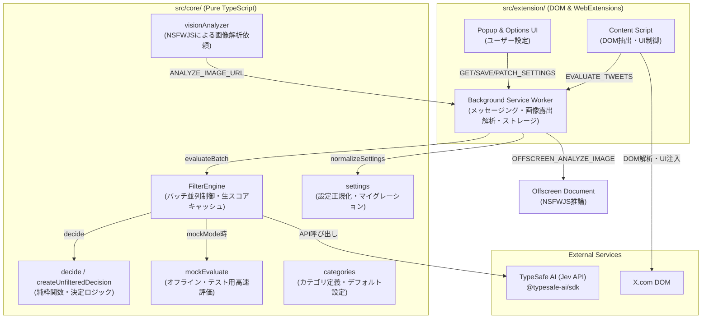

# jev-x アーキテクチャ設計書

本ドキュメントは、`jev-x` のモジュール構成、責務境界、およびデータフローについて説明します。

---

## 1. モジュール構成概要

本プロジェクトは、**コア意思決定ロジック (`src/core/`)** と **ブラウザ拡張機能実装 (`src/extension/`)** を厳格に分離したクリーンアーキテクチャを採用しています。

---

## 2. コア層の純粋性 (`src/core/**`)

### 設計原則
1. **プラットフォーム非依存**:
   - `chrome.*`, `document.*`, `window.*`, `HTMLElement` などのブラウザ固有グローバルに依存しません。
   - ESLint ルール (`no-restricted-globals`) により、DOM や Extension API の混入が静的解析で防止されています。
2. **決定ロジックの純粋関数化**:
   - `decide(categoryScores, tweet, settings, latencyMs)` は副作用のない純粋関数です。
   - 同一の入力に対して常に同一の判定結果 (`FilterDecision`) を返却し、単体テストを瞬時に実行可能です。
3. **設定の安全化とマイグレーション**:
   - `normalizeSettings(stored)` により、不正な値のクランプ（0.0〜1.0）やスキーマバージョン更新（v1 → v2）をコア側で一元管理します。

---

## 3. 拡張機能層 (`src/extension/**`)

### 3.1 Content Script (`src/extension/content/`)
- **`dom/selectors.ts`**: DOMセレクタおよび多言語テキスト辞書（日英対応）。
- **`dom/extract.ts`**: DOMから `TweetData` を抽出。警告オーバーレイの誤検知防止ガードを実装。
- **`ui/render.ts`**: セーフなDOM APIのみを用いたアコーディオンバナーおよびインスペクションバッジの描画。状態遷移に対して完全冪等。
- **`scheduler.ts`**: MutationObserver の変更をバッチ化して background へ送信。設定変更時の即時再描画（`WeakMap` による決定キャッシュ）を管理。
- **`vision.ts`**: 画像要素を検知し、Background 経由で露出解析を非同期リクエスト。

### 3.2 Background Service Worker (`src/extension/background/`)
- **セキュリティ・検証**:
  - `sender.id === chrome.runtime.id` のチェック。
  - `SAVE_SETTINGS` / `PATCH_SETTINGS` は拡張機能UIページからのみ許可（Content Script からの改ざんを遮断）。
  - `ANALYZE_IMAGE_URL` の対象を `https://pbs.twimg.com/*` に限定。
- **有界画像キャッシュ**:
  - 最大500件のLRUキャッシュで同一画像の再フェッチを防止。
- **リアルタイム設定ブロードキャスト**:
  - 設定更新時に全開いている X タブへ `SETTINGS_UPDATED` を通知。

---

## 4. データフローとキャッシュライフサイクル

1. **タイムラインスクロール**:
   - 新規ポスト要素検知 → `dom/extract.ts` で `TweetData` 抽出 → `scheduler.ts` で 150ms デバウンスバッチ化。
2. **評価 (Background & FilterEngine)**:
   - `FilterEngine` で合成キー（`tweetId:imgCount:hasWarn:exp`）を照会。
   - キャッシュミス時: 最大4並列のセマフォワーカーで Jev API または Mock 評価。生スコアをキャッシュ。
   - 決定ロジック `decide()` を通して `FilterDecision` を生成。
3. **UI反映**:
   - `applyFilterUI()` でアコーディオン折りたたみまたはバッジ描画。
4. **遅延画像ロード**:
   - 後から画像が描画された場合、合成キーが変化し、再判定が自動実行。
5. **ポップアップでの設定トグル**:
   - `PATCH_SETTINGS` 送信 → Storage 永続化 → Content Script へ `SETTINGS_UPDATED` 配信 → `WeakMap` に保持された生スコアから手元で即時再判定・DOM即時更新。
